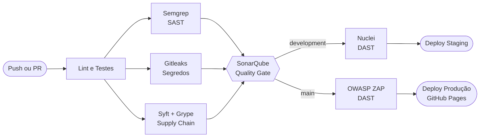

<div align="center">

# 🚀 Azreal

### Fullstack · Spring Boot 3 + Angular 22 Zoneless

Projeto da **Unidade de Extensão Fullstack** — SENAC 2026.2
Docente: **Prof. Fábio Chicout**

[](https://github.com/HtaOliva/Azreal/actions/workflows/ci-cd.yml)
[](https://sonar.fchicout.dev/dashboard?id=azreal-backend)
[](https://sonar.fchicout.dev/dashboard?id=azreal-frontend)


### 🌐 [Ver o site no ar](https://htaoliva.github.io/Azreal/) · 🔍 [Painel no SonarQube](https://sonar.fchicout.dev)

</div>

---

## 📑 Índice

- [Visão geral](#-visão-geral)
- [Pipeline de CI/CD](#-pipeline-de-cicd)
- [Política de branches](#-política-de-branches)
- [Configuração: SonarQube e Secrets](#️-configuração-sonarqube-e-secrets)
- [Rodando localmente](#-rodando-localmente)

---

## 🏛️ Visão geral

Scaffolding padronizado para os projetos da Unidade de Extensão Fullstack.

| Camada | Tecnologias |
| --- | --- |
| **Backend** | Java 21 LTS, Spring Boot 3.3, Spring Web, Spring Validation, Actuator, ArchUnit, Checkstyle, JaCoCo |
| **Frontend** | Angular 22 (100% Zoneless), Signals, OnPush, Vitest, ESLint, build com esbuild/Vite |
| **Qualidade** | SonarQube institucional com o padrão "Sonar way" |
| **Segurança** | Semgrep (SAST), Gitleaks (segredos), Syft + Grype (supply chain), Nuclei e OWASP ZAP (DAST) |
| **Entrega** | GitHub Actions, com deploy do frontend no GitHub Pages |

---

## 🔄 Pipeline de CI/CD

Todo push e todo pull request passam pelas mesmas etapas. Se qualquer *gate* falhar, nada é publicado.



| Etapa | Ferramenta | Bloqueia o pipeline? |
| --- | --- | :---: |
| Lint (Java e Angular) | Checkstyle, ESLint | ✅ |
| Testes e cobertura | JUnit 5, JaCoCo, Vitest | ✅ |
| SAST | Semgrep (OWASP Top 10, Java, TypeScript) | ✅ erros de severidade alta |
| Segredos vazados | Gitleaks | ✅ |
| Supply chain | Syft (SBOM SPDX) + Grype (CVEs) | ✅ vulnerabilidades críticas |
| Qualidade de código | SonarQube (backend e frontend) | ✅ |
| DAST em staging | Nuclei | ⚠️ apenas informativo |
| DAST em produção | OWASP ZAP Baseline | ⚠️ apenas informativo |

---

## 🌳 Política de branches

| Branch | Função | O que o push dispara |
| --- | --- | --- |
| `development` | Integração ativa | Todos os gates, DAST com **Nuclei** e deploy em **Staging** |
| `main` | Versão estável | Todos os gates, DAST com **OWASP ZAP** e deploy em **Produção** |
| `feature/*` · `bugfix/*` | Trabalho individual ligado a Issues | Integradas via Pull Request em `development` |

O passo a passo completo do fluxo está no [GITHUB_SETUP_GUIDE.md](GITHUB_SETUP_GUIDE.md).

---

## ⚙️ Configuração: SonarQube e Secrets

Faça isto antes de abrir o primeiro Pull Request.

<details>
<summary><b>1. Criar o projeto no SonarQube institucional</b></summary>

1. Acesse <https://sonar.fchicout.dev> com as credenciais fornecidas pelo professor.
2. Clique em **Projects → Create Project → Manually**.
3. Preencha:
   - **Project display name:** nome do projeto (ex.: `azreal-backend`).
   - **Project key:** identificador único (ex.: `azreal-backend`).
     Deve ser **idêntico** ao `<sonar.projectKey>` do `pom.xml` da raiz.
   - **Main branch name:** `main`.
4. Gere o token em **My Account → Security → Generate Tokens**:
   - **Type:** `Project Analysis Token`
   - **Project:** o projeto criado
   - **Expires in:** escolha um prazo longo, para o pipeline não quebrar de repente.
5. Copie o token na hora, pois ele só aparece uma vez.

> Cada token vale para um projeto só. O frontend usa um projeto e um token próprios.

</details>

<details>
<summary><b>2. Cadastrar os Secrets no GitHub</b></summary>

Em **Settings → Secrets and variables → Actions → New repository secret**:

| Secret | Valor | Para quê |
| --- | --- | --- |
| `SONAR_TOKEN` *(obrigatório)* | Token do projeto do backend | Autentica a análise do backend |
| `AZREAL_FRONTEND` *(obrigatório)* | Token do projeto do frontend | Autentica a análise do frontend |
| `SONAR_HOST_URL` *(opcional)* | `https://sonar.fchicout.dev` | Endereço do SonarQube |

Depois, em **Settings → Actions → General → Workflow permissions**, escolha **Read and write permissions**.

</details>

<details>
<summary><b>3. Ativar o GitHub Pages</b></summary>

Em **Settings → Pages**, deixe **Source** como **GitHub Actions**. Não use os modelos sugeridos (Jekyll ou Static HTML), porque o `ci-cd.yml` já faz a publicação.

</details>

<details>
<summary><b>4. Proteger as branches</b></summary>

Em **Settings → Branches → Add branch protection rule**, para `development` e `main`:

- ✅ Require a pull request before merging (mínimo de 1 aprovação)
- ✅ Require status checks to pass before merging:
  - `🧪 Lint & Automated Tests`
  - `🔒 SAST - Semgrep Security Audit`
  - `📦 Supply Chain - Syft (SBOM) & Grype (CVEs)`
  - `🛡️ SonarQube Quality Gate`
  - `🛡️ SonarQube Quality Gate (Frontend)`
- ✅ Require branches to be up to date before merging

</details>

---

## 💻 Rodando localmente

Valide tudo antes de abrir o Pull Request.

### Backend · Spring Boot 3 + Java 21

```bash
# Checkstyle, testes JUnit 5 e relatório JaCoCo
mvn -B checkstyle:check test jacoco:report -f backend/pom.xml

# Subir a aplicação
mvn clean spring-boot:run -f backend/pom.xml
```

| Recurso | Endereço |
| --- | --- |
| Boas-vindas | <http://localhost:8080/api/v1/hello> |
| Healthcheck | <http://localhost:8080/api/v1/health> |
| Relatório JaCoCo | `backend/target/site/jacoco/index.html` |

### Frontend · Angular 22 Zoneless

```bash
cd frontend

npm ci                  # instalação limpa
npm run lint            # ESLint
npm run test:coverage   # testes com Vitest
npm run build           # build de produção com esbuild
npm start               # servidor local
```

Aplicação web: <http://localhost:4200>

---

<div align="center">

Feito com ☕ pela **Equipe Azrael** · SENAC 2026.2

</div>
